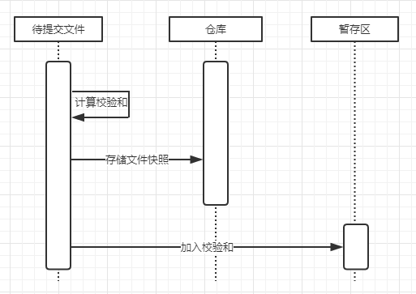
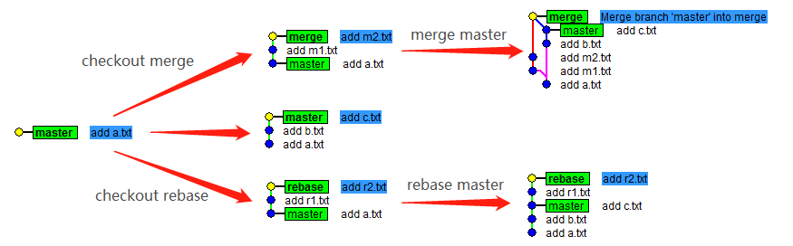
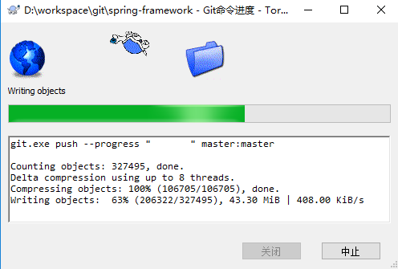

# Git 操作文档
Git 是一个十分流行的版本控制系统，Git 和 SVN 区别在于，`SVN`使用**增量文件系统**，存储每次提交之间的差异。而 `git` 使用**全量文件系统**，存储每次提交的文件的全部内容(snapshot)。

git 保存的不是文件的变化或者差异，而是**一系列不同时刻的文件快照**。

Git [文档地址](https://git-scm.com/book/zh/v2)

## 目录
* [安装](#安装)
* [配置](#配置)
	* [别名](#别名)
* [初始化仓库](#初始化仓库)
* [获取项目](#获取项目)
* [更新代码](#更新代码)
* [分支管理](#分支管理)
* [查看状态](#查看状态)
* [查看历史](#查看历史)
* [标签管理](#标签管理)
* [变基操作](#变基操作)
* [暂存变更](#暂存变更)
* [获取指定分支代码](#获取指定分支代码)
* [回滚操作](#回滚操作)
* [cherry-pick](#cherry-pick)
* [附录](#appendix_a)
    * [本地版本库](#appendix_a)
    * [支持 http 方式 clone](#appendix_b)
    * [将 git 上的项目 push 到自己的 repo](#appendix_c)
    * [同步两个远端仓库代码](#appendix_d)
    * [覆盖本地代码](#appendix_e)

## 安装
linux 下 git 安装很简单，apt-get 和 yum 直接装即可.
```
$ yum install -y git
```

## 配置
使用`git config`进行信息配置, 其实是针对 config 文件进行配置
```
$ cat config
[core]
        repositoryformatversion = 0
        ...
[remote "origin"]
        url = https://...
        fetch = +refs/heads/*:refs/remotes/origin/*
[branch "master"]
        remote = origin
        merge = refs/heads/master
```

若加上`--global`, 则是全局配置, 比如配置 [user] 域下的 name 和 email 信息。
```
$ git config --global user.name "bascker"
$ git config --global user.email "xxx@xx.com"

# 查看 git 配置信息
$ git config --list
```
### 别名
跟 linux 别名命令 `alias` 一样，git 也可以设置别名。
```
# 给 checkout 设置别名 ck，git ck 等价于 git checkout
$ git config --global alias.ck checkout
$ git config -l | grep alias
alias.ck=checkout
```

## 初始化仓库
使用`git init`可以创建一个 git 仓库。一般而言，纯粹用于版本控制的仓库，以 `.git`结尾。
```
# 初始化一个 git 仓库
$ git init sample.git
```

一般创建完仓库后，我们需要执行如下命令来允许 push 操作.
```
$ git config --gloabl receive.denyCurrentBranch ignore

# 若不执行, 可能会导致 push 失败, 报错
$ git push
remote: error: refusing to update checked out branch: refs/heads/master
remote: error: By default, updating the current branch in a non-bare repository
remote: error: is denied, because it will make the index and work tree inconsistent
remote: error: with what you pushed, and will require 'git reset --hard' to match
remote: error: the work tree to HEAD.
remote: error:
remote: error: You can set 'receive.denyCurrentBranch' configuration variable to
remote: error: 'ignore' or 'warn' in the remote repository to allow pushing into
remote: error: its current branch; however, this is not recommended unless you
remote: error: arranged to update its work tree to match what you pushed in some
remote: error: other way.
remote: error: To squelch this message and still keep the default behaviour, set
remote: error: 'receive.denyCurrentBranch' configuration variable to 'refuse'.
```

上面这个配置比较麻烦，可以在创建 git 仓库时一次性解决。使用如下命令即可。
```
# --shared 参数
$ git init --bare --shared sample.git
```

## 获取项目
git 支持 ssh/http(s)/ftp(s) 方式来获取远端代码. 通过`git clone`命令即可.
```
$ git clone https://USER_NAME:USER_PASS@IP/sample.git
```
命令选项:
* `-b`: 获取指定分支，若不存在则报错
* `--depth`: 获取代码的深度。若指定为 1，则只会获取到远程仓库的 master 分支

## 更新代码
最常用/基本操作，就是在本地进行代码/文本编辑后，提交代码入库.
```
# 跟踪当前目录下所有文件的变更
$ git add .
# 提交变更
$ git commit -m "描述信息"
# 推送到远端代码库
$ git push
```
对于 commit 而言, 注释最好以一行短句子(小于 50 个字符)作为开头, 然后空一行再把进行详细的注释,这样可以很方便的用工具把 commit 注释变成 email 通知，第一行作为标题，剩下的部分就作 email 正文.

强制覆盖远端分支，可以使用 -f 选项.
```
$ git push -f origin master
```

push 也可用于删除远端分支
```
# 语法: git push -f origin :BRANCH_NAME
$ git push -f origin :test
To https://github.com/bascker/sample.git
 - [deleted]         test
```

拉取远端最新代码
```
# 推荐在 pull 时使用 rebase 选项
git pull --rebase origin master
```

## 分支管理
一般使用 `git branch` 和 `git checkout` 进行基础的分支管理操作.当然更进一步就是使用`git merge/fetch/rebase`命令了(这些命令的使用, 容后再议).

```
# 查看当前仓库的所有分支
$ git branch -a
* master
  remotes/origin/master

# 切换分支: -b 表示若无指定分支，则新建一个分支
$ git checkout -b bascker
Switch to a new branch 'bascker'

# 删除分支: 若使用 -D，则强制删除
$ git branch -d bascker

# 修改分支名
$ git branch -m OLD_NAME NEW_NAME
```

第一次 push 本地分支代码到远端时, 需要加 --set-upstream, 从而在远端创建一个分支.
```
$ git push --set-upstream origin bascker
```
**git 分支本质就是指向提交对象（校验和文件）的指针**，每次 commit，指针都会移动，指向最后一个 commit 对象。commit 流程图如下所示。  


特殊 HEAD 指针，指向当前分支。若当前在 master 分支，则 HEAD 指向 master 分支。若在 bascker 分支，则指向 bascker。
```
# 使用 --decorate 查看分支各分支指针所指向的对象
$ git log --oneline --decorate
aa403d4 (HEAD -> master, bascker) add b2.txt
...
```
如上，HEAD 指向 master 分支，master & bascker 均执行 aa403d4 提交对象。

对于远端分支的管理，则使用 git remote 命令。
```
# 查看远端分支
$ git remote -v
origin  https://github.com/bascker/git-doc.git (fetch)
origin  https://github.com/bascker/git-doc.git (push)

# 修改远端仓库，如当远端仓库被修改时，可以使用
$ git remote set-url NAME NEW_URL OLD_URL
```

### 分支合并
当在分支 bascker 上进行开发后，想把代码合入主干 master，就可以执行合并操作 `git merge`.
```
# master 分支执行
$ git merge bascker
```
若出现冲突，则解决完冲突，在继续 merge.
> Note：除第一次 commit 外，每次 commit 对象都会有一个父对象，多分支合并产生的 commit 对象有多个父对象。

## 查看状态
使用 git status 可以查看当前工作目录的状态，查看索引内容,哪些文件被暂存了(在Git索引中), 哪些文件被修改了但是没有暂存, 哪些文件没有被跟踪(untracked)。git 十分人性化的一点就在于每一个时间点，使用 git status 都有提示，告诉你下一步怎么做.
```
$ echo aaa > a.txt
$ git add a.txt
$ git status
On branch master
Your branch is up-to-date with 'origin/master'.
Changes to be committed:
  (use "git reset HEAD <file>..." to unstage)

        new file:   a.txt

Untracked files:
  (use "git add <file>..." to include in what will be committed)

        .idea/
```

## 查看历史
使用`git log`可以看到历史提交信息，搭配`git show`使用效果更佳.
```
$ git commit -m "add a.txt"
$ git log
commit 3da5d8691146288de84a466cbfb123fed5171329
Author: bascker <xxx@aliyun.com>
Date:   Sat May 26 22:16:15 2018 +0800

    add a.txt

# 查看 commit 对象信息
$ git show 3da5d8691146288de84a466cbfb123fed5171329
commit 3da5d8691146288de84a466cbfb123fed5171329
Author: bascker <jp2317015793@aliyun.com>
Date:   Sat May 26 22:16:15 2018 +0800

    add a.txt

diff --git a/a.txt b/a.txt
new file mode 100644
index 0000000..3c8969b
--- /dev/null
+++ b/a.txt
@@ -0,0 +1 @@
+aaa

# 使用 --oneline 可以将各个 commit 信息简单化
$ git log --oneline
aa403d4 add b2.txt
e4bf2fe add b1.txt
...
```
> git show 用于查看 git 对象信息, 每一次提交都是一个 commit 对象，包括分支、tag 也是对象.

git log 常见选项
* `--stat`: 显示在每个提交(commit)中哪些文件被修改了, 这些文件分别添加或删除了多少行内容
* `--pretty`: 格式化日志输出
* `--graph`: 图形化显示


## 标签管理
标签即 tag，通过`git tag`来进行标签管理，用于版本发布. 标签分为 2 种：
* 轻量标签：指向 commit 提交对象的引用
* 附注标签：生成独立的 tag 对象，拥有完整信息，建议使用

```
# 轻量标签
$ git tag v1.0.light

# 附注标签: 最简单方式就是使用 -a -m 参数
$ git tag -a v1.1 -m "附注标签"

$ git tag
v1.0.light
v1.1

# 查看标签对象
$ git show v1.1
Tagger: bascker <xxx@aliyun.com>
Date:   Sat May 26 22:31:35 2018 +0800

<E9><99><84><E6><B3><A8><E6><A0><87><E7><AD><BE>

commit 3da5d8691146288de84a466cbfb123fed5171329
Author: bascker <xxx@aliyun.com>
Date:   Sat May 26 22:16:15 2018 +0800

    add a.txt

diff --git a/a.txt b/a.txt
new file mode 100644
index 0000000..3c8969b
--- /dev/null
+++ b/a.txt
@@ -0,0 +1 @@
+aaa

# 使用 git checkout 可以切换到指定标签
$ git checkout v1.1
```

若要获取远端仓库所有 tag，则可以执行如下操作
```
# fetch 拉取远端所有 tag 到本地
$ git fetch --tags

# 切换到指定 tag 1.6.1
# 语法: git checkout -b LOCAL_BRANCH_NAME ORIGIN_TAG_NAME
$ git checkout -b 1.6.1 1.6.1
```

## 变基操作
一般都是使用`git merge`进行分支合并, 但还有一种更棒的方式就是`git rebase`变基操作.所谓变基，就是变更基线.  


如图所示，我们基于 master 创建了 merge 和 rebase 分支, 在 merge 和 rebase 分支上分别前进了 2 次, 与此同时, master 也前进了, 这时候我们分别在 merge 分支执行 `git merge master` 和在 rebasr 分支执行 `git rebase master` 利用 `gitk` 查看结果，可以看到 rebase 操作的分支历史比 merge 干净整洁很多.
> Note: gitk 是一个以图形的方式显示项目历史的命令

```
$ git rebase master
First, rewinding head to replay your work on top of it...
Applying: add r1.txt
Applying: add r2.txt
```
git rebase 操作会将本地的提交历史，由远及近逐一跟 master 进行合并。若发送冲突，则需要我们手工解决冲突后，执行 `git rebase --continue` 继续之前的操作即可.

git rebase 还拥有将多个 commit 合并成一个 commit 的逆天功能，这个功能十分有用.
```
# 将前 2 次提交进行 rebase
$ git rebase -i HEAD~2
```
这样就会进入命令模式, 然后此时我们将除第一行的 pick 外，全部改为 s
```
# 原来自动提示的
pick f8f5714 add b1.txt
pick aea2a1b add b2.txt

# 修改后的
pick f8f5714 add b1.txt
s aea2a1b add b2.txt
```
保存后，会自动弹出命令模式，修改 commit 的 message 信息
```
# This is a combination of 2 commits.
# The first commit's message is:

add b1.txt

# This is the 2nd commit message:

add b2.txt
```
我们将commit信息改为如下
```
# This is a combination of 2 commits.
add b1.txt, b2.txt
```
保存后，rebase 操作会逐一将第一条、第二条commit 进行合并
```
[detached HEAD 89b4f07] add b1.txt, b2.txt
 Date: Sat Nov 10 15:19:09 2018 +0800
 1 file changed, 138 insertions(+), 12 deletions(-)
Successfully rebased and updated refs/heads/master.
```

**Note**
1. 若 rebase 过程出现 conflict，则解决冲突后，执行 `git rebase --continue` 即可
2. 若不想 rebase 了，则 `ctrl + c` 中断后，执行 `git rebase --abort` 即可

## 暂存变更
有时候我们还未开发代码完毕，需要切到其他分支，但又不想执行 commit 提交变更时，可通过`git stash`命令来暂存变更.
```
$ echo ccc > c.txt
$ git stash				# 暂存变更
$ git stash list
stash@{0}: WIP on bascker: aea2a1b add b2.txt

# 切换到其他分支, 执行某些操作
$ git checkout master
$ ...

# 切换回后，取回缓存
$ git stash pop

# 再执行 git stash list 显示没有暂存了
```

## 获取指定分支代码
有时候我们需要获取指定分支的代码，怎么办呢？可以通过`git fetch & git checkout` 来实现.
```
# 1.fetch 指定分支到本地
$ git fetch origin ORIGIN_BRANCE_NAME

# 2.将远程分支映射到本地
$ git checkout -b LOCAL_BRANCH_NAME origin/ORIGIN_BRANCE_NAME
```

## 回滚操作
git 操作万一失误了，怎么办？ 放心，git 提供了强大的故障恢复机制，提供 `git reset` 命令来提供回滚操作。
```
$ echo "just a text" > test.txt
# 对 test.txt 进行跟踪
$ git add .
$ git status
On branch master
Changes to be committed:
  (use "git reset HEAD <file>..." to unstage)

        new file:   test.txt

# 回滚
$ git reset
$ git status
On branch master
Untracked files:
  (use "git add <file>..." to include in what will be committed)

        test.txt

nothing added to commit but untracked files present (use "git add" to track)

$ rm c.txt
$ git add .
$ git commit -m "rm c.txt"
$ git log --oneline
0ac49d7 rm c.txt
aa403d4 add b2.txt
e4bf2fe add b1.txt
...
$ ls
a.txt*  b.txt*  b1.txt*  b2.txt*

# 回滚到 rm 前的
$ git reset --hard HEAD~2
HEAD is now at e4bf2fe add b1.txt
$ ls
a.txt*  b.txt*  b1.txt*  c.txt*
$ git log --oneline
e4bf2fe add b1.txt
b0ccab5 c.txt
...
```

也可以搭配 git reflog（可看到所有的 git 操作记录） 来进行回滚，如执行了错误的 rebase 时，就可以搭配进行救急。
```
$ git reflog
e7ebdde HEAD@{0}: reset: moving to HEAD~1
d7154af HEAD@{1}: commit: add test.txt
e7ebdde HEAD@{2}: reset: moving to HEAD

# 回滚到 add test.txt 这个阶段
$ git reset --hard HEAD@{1}
```

## cherry-pick
使用 `git cherry-pick` 可以将某个commit 应用到当前分支
```
$ git cherry-pick COMMIT_ID
```
有时候使用 git cherry-pick 时，可能会遇到如下信息提示.
```
$ git cherry-pick a6e8
error: commit a6e8 is a merge but no -m option was given.
fatal: cherry-pick failed

# 查看 git 历史
$ git log
commit a6e8a28a518e5124d5ce53c08d4211583c5fd9c5
Author: bascker ...
Date:   ...

    CCC

commit 3f1b6ab19ced3d1ab1570e6b820b9fe55cc8ca3b
Author: bascker ...
Date:   ...

    Merge branch "br_test" of code...

commit 7f6862f9a31bc0da2eaa0a6426f0fb54baf1bfae
Author: bascker ...
Date:   ...

    BBB

commit 0a6aabf9a31bc0da2eaa0a6426f0fb54baf1bfae
Author: bascker ...
Date:   ...

    AAA
```
出现这个问题是因为提交的代码之前 pull 了其他人的代码并合入到了自己本地的代码。产生了
一个merge后，又push到代码仓。

查看 a6e8 这个 commits
```
$ git show a6e8
Author: bascker xxxx
Committer: bascker xxxx
Parent: 7f6862...
Parent: 0a6aab...
Child: 382f5da...
```
可以看到parent节点有2个，一个merge里有多个父节点，cherry-pick的时候至少要指定一个
父节点。可以使用 -m parent-num 来设置。parent-num默认从 1 开始，如上述 2 个节点，
 7f 编号为 1，0a 编号为 2.
```
# 将 a6e8 这个 commit 的父节点指向 7f68
$ git cherry-pick a6e8 -m 1
...

# 再次看历史，会变成如下
$ git log
CCC
BBB
AAA
```

<b id="appendix_a"></b>
## 附录
### 本地版本库
若没有远程 git 仓库，没法很好的练习 git 操作咋办呢？没问题，我们可以使用本地版本库。通过在本地创建一个 git 仓库，可以将其 clone 到另一路径，然后进行 git 操作.
```
$ cd repo
$ git init sample.git

$ cd ..
$ git clone repo/sample.git
```
其实就是 git 本地协议的支持，将本地硬盘的一个目录作为远程版本库来使用。git 支持 4 种协议：

* 本地协议
* HTTP(S) 协议
* SSH 协议
* git 协议

<b id="appendix_b"></b>
### 支持 http 方式 clone
想通过 HTTP 方式来进行 git clone 操作，是需要配置 httpd 服务的.
#### 1 安装软件
为了使用 git-http-backend(支持 git 的 CGI 程序), 需要按照 git-core，apache 支持 git 就靠它
```
$ yum install -y git git-core httpd
```

#### 2 配置 http 账户
```
# 修改仓库所有者，使得 apache 可以访问
$ chown -R apache:apache /workspace/gitrepo

# 创建 apache 账户 tanlang.
# -m：使用 MD5 算法对密码进行加密
# -c：创建一个加密文件
$ htpasswd -m -c /etc/httpd/conf.d/git.htpassd tanlang
New password:
Re-type new password:
Adding password for user tanlang

# 修改 git.htpasswd 文件的所有者与所属群组, 以及权限
$ chown apache:apache /etc/httpd/conf.d/git.htpassd
$ chmod 640 /etc/httpd/conf.d/git.htpassd
```
#### 3 配置 httpd
修改 `/etc/httpd/conf/httpd.conf` 配置文件，末尾添加如下内容.
```
<VirtualHost *:80>
        ServerName 106.xxxx.xxx                                     # 服务器地址/域名
        SetEnv GIT_HTTP_EXPORT_ALL
        SetEnv GIT_PROJECT_ROOT /workspace/gitrepo/                 # 代码存放路径
        ScriptAlias /git/ /usr/libexec/git-core/git-http-backend/   # 以/git/开头的访问路径映射至git的CGI程序git-http-backend
        <Location />
                AuthType Basic
                AuthName "Git"
                AuthUserFile /etc/httpd/conf.d/git.htpasswd         # 验证用户帐户的文件
                Require valid-user
        </Location>
</VirtualHost>
```

#### 4 启动服务
```
$ systemctl enable httpd
$ systemctl start httpd
```

#### 5 测试
通过以上步骤，就可以使用 http 方式进行 clone 了.
```language
$ git clone http://***/git/sample.git
Cloning into 'sample'...
```

<b id="appendix_c"></b>
### 将 git 上的项目 push 到自己的 repo
以 spring-framework 为例，当 clone 下这个项目后，改动代码，提交变更, 然后 push 的话会 push 到 github 上去。那么如果我们只想将代码 push 到自己的 git 仓库呢？其实很简单，只需要添加自己的远程仓库地址，在 push 是选择 push 到我们自己的仓库就行.
```language
$ git remote add bascker ssh://IP/root/workspace/gitrepo/spring-framework.git
$ git remote -v
origin  https://github.com/spring-projects/spring-framework.git (fetch)
origin  https://github.com/spring-projects/spring-framework.git (push)
bascker ssh://IP/root/workspace/gitrepo/spring-framework.git (fetch)
bascker ssh://IP/root/workspace/gitrepo/spring-framework.git (push)
```
用小乌龟 push 时，选择目标 bascker 分支即可.  


<b id="appendix_d"></b>
### 两个仓库的代码同步
git使用中可能存在两个远程仓库需要进行代码同步的场景。比如很久以前，将所有项目模块继承在一个 Maven 项目 projectA 中，突然某一天需要将其中的
模块 moduleB 从中移出，单独建立一个项目 projectB，作为独立服务。但此时因为无法立即迁移，还需要在 projectA 中继续进行 moduleB 的代码
编辑，因此需要将在 projectA 中的 moduleB 最新提交的代码同步到 projectB。如何执行？
> sample.git 作为 projectA，demo.git 作为 projectB

主要应用以下 3 个 git 操作的语法
```
# 添加远端地址
$ git remote add NAME REMOTE_GIT_ADDRESS

# 推送指定 commit 到远端
$ git push <remote name> <commit hash>:<remote branch name>

# 将指定 commit 应用到当前分支
$ git cherry-pick COMMIT_HASH
```

#### 方法1 git remote & git push
使用 `git remote add` & `git push 指定commit号`来解决
```
$ git remote -v
origin  https://github.com/bascker/sample.git (fetch)
origin  https://github.com/bascker/sample.git (push)

# 1. 添加 demo.git 的远端地址
$ git remote add demo https://github.com/bascker/demo.git

$ git remote -v
demo  https://github.com/bascker/demo.git (fetch)
demo  https://github.com/bascker/demo.git (push)
origin  https://github.com/bascker/sample.git (fetch)
origin  https://github.com/bascker/sample.git (push)

# 2. 在 sample 中修改代码
$ echo "demo" > demo.txt
$ git add demo.txt
$ git commit -m "Update Demo"
$ git log
commit a6e869d8f671320416f82607bd451cf958e017da
Author: bascker <xxxx@xxx.com>
Date:   Sat Nov 10 14:42:09 2018 +0800

  Update Demo

# 3. 推送到 sample.git
$ git push origin master

# 4. 将本次对 demo 的修改 commit 推送到 demo.git
$ git push demo a6e869d8f671320416f82607bd451cf958e017da:master
Counting objects: 3, done.
Delta compression using up to 4 threads.
Compressing objects: 100% (2/2), done.
Writing objects: 100% (3/3), 278 bytes | 0 bytes/s, done.
Total 3 (delta 1), reused 0 (delta 0)
To https://github.com/bascker/demo.git
 + d7154af...a6e869d a6e869d8f671320416f82607bd451cf958e017da -> master
```

#### 方法2 git remote & git cherry-pick
使用 `git remote add` & `git cherry-pick`来解决
```
# demo.git
$ git remote -v
origin  https://github.com/bascker/demo.git (fetch)
origin  https://github.com/bascker/demo.git (push)

# 1. 添加 sample.git 的远端地址
$ git remote add sample https://github.com/bascker/sample.git

$ git remote -v
origin  https://github.com/bascker/demo.git (fetch)
origin  https://github.com/bascker/demo.git (push)
sample  https://github.com/bascker/sample.git (fetch)
sample  https://github.com/bascker/sample.git (push)

# 2. 在 sample 中修改代码
$ echo "demo" > demo.txt
$ git add demo.txt
$ git commit -m "Update Demo"
$ git log
commit a6e869d8f671320416f82607bd451cf958e017da
Author: bascker <xxxx@xxx.com>
Date:   Sat Nov 10 14:42:09 2018 +0800

  Update Demo

# 3. 推送到 sample.git
$ git push origin master

# 4. 在 demo 中拉取 sample 的最新代码, 从而得到 sample 中最新对 demo 修改的 commit 号
$ git fetch sample master

# 5. 将对 demo 修改的 commit 应用到当前分支, 若有冲突，则解决
$ git cherry-pick a6e869d8f671320416f82607bd451cf958e017da

# 6. 推送到远端
$ git push origin master
```
<b id="appendix_e"></b>
### 覆盖掉本地代码
1.获取远端最新代码
```
$ git fetch --all
```

2.重置 HEAD 到指定分支
```
$ git reset --hard origin/master
```
